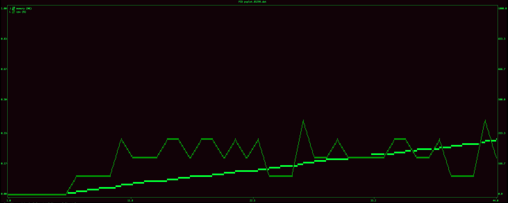

# PSPLOT



## LIVE
Live plots the CPU(%) and MEMORY(MB) a process by its PID.   
Saves the data at `psplot.PID.dat`.   

```sh
    psplot live <PID> [--interval=1 --ylim=1000]
```

## CAPTURE
Only captures the process info and saves it to the file.  

```sh
    psplot capture <PID> [--interval=1]
```

## LIVE
Receives the file with the process data to be plotted like the live command.   

```sh
    psplot plot <fname> [--interval=1 --ylim=1000 --tail=-1]
```
